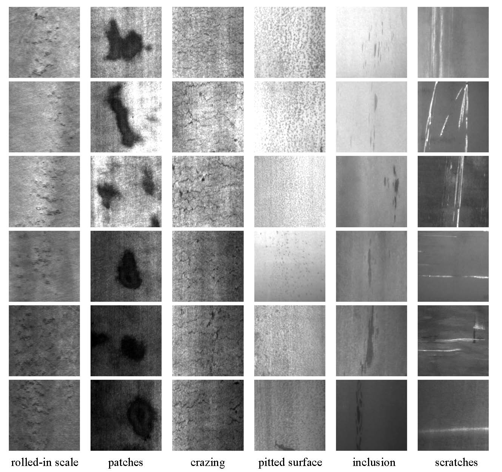

# Detection of Defects on Metallic Surfaces with Convolutional Neural Networks with Pytorch

## Possible Business Use Cases
This neural network can be applied to the **iron and steel industry** or **machine manufacturers** as it can help to identify defects on the surface of a metal part produced by a casting process.  

An inspection system should be set up and collect the **binary images** using vision technology. Connected components of these images are processed to **find the shadows** originated from defects. Then convert these images into pixels before passing into the **neural network** which will be processing on **GPUs** to accelerate the computation speed.  

## Dataset : 
   
This dataset was created by  Northeastern University (NEU), consisting 1,800 grayscale images of 6 different types of typical surface defects of the hot-rolled steel strip: rolled-in scale (RS), patches (Pa), crazing (Cr), pitted surface (PS), inclusion (In) and scratches (Sc). 

For each category, 300 samples can be found in the folder.   

For each image, the original resolution is 200×200 pixels.  

This Metal Surface Defects Dataset can be download at [Kaggle](https://www.kaggle.com/fantacher/neu-metal-surface-defects-data) or [Northeastern University (NEU)](http://faculty.neu.edu.cn/yunhyan/NEU_surface_defect_database.html) official website. If you use the official website for downloads, please use [NEU-CLS](https://drive.google.com/file/d/1NGlXT9sIaQpyxUoT6MLKm1Pr6x8oxOvc/view) for this image classification task.  
   
## Methodology & Result :   
 
The convolutional neural network consists of 3 convolutional layers and 3 dense layers, and applies rectified linear units(ReLU) on each convolutional layers with max pooling over 3x3 pixels.  
For optimizer, we used Adam Optimizer which is a combination of the ‘gradient descent with momentum’ algorithm and the ‘RMSP’ algorithm. For Momentum part, it takes the ‘exponentially weighted average’ of the gradients into account which helps the algorithm to reach the minima faster. For Adaptive Learning Rate part, the learning rate is adjusted in the training phase by reducing the learning rate to a pre-defined schedule using ‘exponential moving average’. For loss function, we used mean squared error as because the targets are one-hot vectors.

We achieved **95% accuracy** of detection by using 70% of total number of images (i.e. 1260 images) to train the convolutional neural networks and using the rest 30% of images (i.e. 540 images) for testing.  

## Limitation & Possible Improvement : 
        Left : Inclusions                 Right : Pitted Surface  
                      

Some images of **inclusions** were classified as pitted surface by the neural network. For pitted surface, we can see many small dots on the surface. The neural network may get confused as the image above shows many noises(dark dots). But the neural network should have recognised the feature of inclusions, i.e. the black lines.
